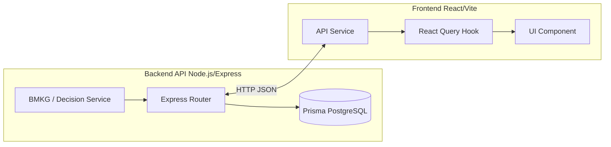

# Dokumentasi Logika & Arsitektur Teknis SIGAP Desa Cibenda
> **Panduan Ringkas & Acuan Teknis Kode untuk Presentasi / Demo Client**  
> *Sistem Informasi Gawat Darurat & Monitoring Cuaca Desa Cibenda, Kecamatan Parigi, Kabupaten Pangandaran*

---

## 📌 1. Pendahuluan & Titik Acuan Geografis

Sistem **SIGAP** dirancang dengan arsitektur Monorepo (`apps/backend` dan `apps/frontend`). Semua kalkulasi spasial kebencanaan berbasis pada koordinat geografis pusat Desa Cibenda.

* **Koordinat Acuan Desa Cibenda:** `Latitude: -7.683800`, `Longitude: 108.560953`
* **File Konfigurasi Backend:** [`apps/backend/.env`](file:///c:/Kuliah%20Widyatama/sigap_app/apps/backend/.env) (`VILLAGE_LAT` & `VILLAGE_LON`)
* **Prinsip Kalkulasi Jarak (Haversine Formula):**
  Implementasi di [`EarthquakeService.haversineDistanceKm()`](file:///c:/Kuliah%20Widyatama/sigap_app/apps/backend/src/services/earthquake.service.ts#L225):
  $$\text{d} = 2R \cdot \arcsin\left(\sqrt{\sin^2\left(\frac{\Delta\phi}{2}\right) + \cos(\phi_1)\cos(\phi_2)\sin^2\left(\frac{\Delta\lambda}{2}\right)}\right)$$
  *(di mana $R = 6371\text{ km}$, $\phi$ = latitude, $\lambda$ = longitude)*

---

## 🗺️ 2. Arsitektur Teknis Per Fitur Dashboard

Berikut adalah pemetaan alur kode dari **Backend Service ➔ Backend Route ➔ Frontend Service ➔ Frontend Hook ➔ UI Component**:



---

### 🚨 Fitur 1: Current Alert Card & Decision Engine (Status Utama Aplikasi)

* **Deskripsi:** Menampilkan level kesiapsiagaan utama (GREEN, YELLOW, ORANGE, RED) di bagian paling atas dashboard.
* **Alur Kode & File Kunci:**
  1. **Decision Engine:** [`apps/backend/src/services/decisionEngine.service.ts`](file:///c:/Kuliah%20Widyatama/sigap_app/apps/backend/src/services/decisionEngine.service.ts)  
     Mengevaluasi kombinasi data gempa + tsunami BMKG berdasarkan hierarki aturan keselamatan.
  2. **Alert Scheduler:** [`apps/backend/src/scheduler/alert.scheduler.ts`](file:///c:/Kuliah%20Widyatama/sigap_app/apps/backend/src/scheduler/alert.scheduler.ts)  
     Mengeksekusi pengecekan BMKG setiap 60 detik (`setInterval`). Jika alert berubah, data disimpan ke database via [`AlertService.saveAlert()`](file:///c:/Kuliah%20Widyatama/sigap_app/apps/backend/src/services/alert.service.ts).
  3. **Backend Route:** `GET /api/v1/public/alerts/current` ➔ [`apps/backend/src/routes/alert.route.ts`](file:///c:/Kuliah%20Widyatama/sigap_app/apps/backend/src/routes/alert.route.ts)
  4. **Frontend Service:** [`apps/frontend/src/services/alertService.ts`](file:///c:/Kuliah%20Widyatama/sigap_app/apps/frontend/src/services/alertService.ts) (`alertService.getCurrent`)
  5. **Frontend Hook:** [`apps/frontend/src/features/dashboard/hooks/useCurrentAlert.ts`](file:///c:/Kuliah%20Widyatama/sigap_app/apps/frontend/src/features/dashboard/hooks/useCurrentAlert.ts) (`refetchInterval: 60s`)
  6. **UI Component:** [`apps/frontend/src/features/dashboard/components/CurrentAlertCard.tsx`](file:///c:/Kuliah%20Widyatama/sigap_app/apps/frontend/src/features/dashboard/components/CurrentAlertCard.tsx)

#### 📊 Aturan Hirarki Decision Engine:
| Level Alert | Warna Badge | Syarat Pemicu (Rules) |
| :--- | :--- | :--- |
| **RED (AWAS)** | 🔴 Merah | Hanya dipicu oleh **Peringatan Tsunami AWAS** dari InaTEWS/BMKG. |
| **ORANGE (SIAGA)** | 🟠 Oranye | Peringatan Tsunami SIAGA **ATAU** Gempa Pangandaran yang **dirasakan warga** di Desa Cibenda (berdasarkan keyword pada field `felt` skala MMI BMKG). |
| **YELLOW (WASPADA)** | 🟡 Kuning | Peringatan Tsunami WASPADA **ATAU** Gempa terdeteksi dalam radius 150 km Pangandaran tetapi belum/tidak dirasakan warga. |
| **GREEN (AMAN)** | 🟢 Hijau | Kondisi normal, tidak ada ancaman resmi BMKG. |

---

### 🌋 Fitur 2: Monitoring Gempa Bumi (3 Card)

* **Deskripsi:** Memantau gempa bumi di 3 cakupan wilayah: Indonesia (Nasional), Jawa Barat (Regional), dan Pangandaran (Lokal).
* **Alur Kode & File Kunci:**
  1. **Backend Service:** [`apps/backend/src/services/earthquake.service.ts`](file:///c:/Kuliah%20Widyatama/sigap_app/apps/backend/src/services/earthquake.service.ts)
     * `getIndonesia()` ➔ Mengambil gempa terbaru dari `https://data.bmkg.go.id/DataMKG/TEWS/autogempa.json`
     * `getWestJava()` ➔ Filter radius 350 KM (`WEST_JAVA_RADIUS_KM`) & umur max 30 hari (`WEST_JAVA_MAX_AGE_DAYS`).
     * `getPangandaran()` ➔ Filter radius 150 KM (`PANGANDARAN_RADIUS_KM`) & umur max 30 hari (`PANGANDARAN_MAX_AGE_DAYS`).
  2. **Backend Routes:** [`apps/backend/src/routes/earthquakes.route.ts`](file:///c:/Kuliah%20Widyatama/sigap_app/apps/backend/src/routes/earthquakes.route.ts)
     * `GET /api/v1/public/earthquakes/indonesia`
     * `GET /api/v1/public/earthquakes/west-java`
     * `GET /api/v1/public/earthquakes/pangandaran`
  3. **Frontend Hooks:**
     * [`useIndonesiaEarthquake.ts`](file:///c:/Kuliah%20Widyatama/sigap_app/apps/frontend/src/features/dashboard/hooks/useIndonesiaEarthquake.ts)
     * [`useWestJavaEarthquake.ts`](file:///c:/Kuliah%20Widyatama/sigap_app/apps/frontend/src/features/dashboard/hooks/useWestJavaEarthquake.ts)
     * [`usePangandaranEarthquake.ts`](file:///c:/Kuliah%20Widyatama/sigap_app/apps/frontend/src/features/dashboard/hooks/usePangandaranEarthquake.ts)
  4. **UI Component:** [`apps/frontend/src/features/dashboard/components/EarthquakeCard.tsx`](file:///c:/Kuliah%20Widyatama/sigap_app/apps/frontend/src/features/dashboard/components/EarthquakeCard.tsx)
     * **Penanganan Gambar ShakeMap:** Komponen sub `ShakemapImage` menggunakan CSS `object-contain` agar gambar peta guncangan BMKG tidak pernah terpotong di layar HP maupun Desktop.

---

### 🌊 Fitur 3: Monitoring Tsunami

* **Deskripsi:** Memantau status ancaman tsunami dari sistem peringatan dini resmi InaTEWS BMKG.
* **Alur Kode & File Kunci:**
  1. **Backend Service:** [`apps/backend/src/services/bmkg.service.ts`](file:///c:/Kuliah%20Widyatama/sigap_app/apps/backend/src/services/bmkg.service.ts) (`getTsunamiStatus()`)  
     Fetch data dari `https://inatews.bmkg.go.id/new/tvt.php` + pemindaian keyword potensi tsunami otomatis pada data gempa BMKG.
  2. **Backend Route:** `GET /api/v1/public/tsunami` ➔ [`apps/backend/src/routes/tsunami.route.ts`](file:///c:/Kuliah%20Widyatama/sigap_app/apps/backend/src/routes/tsunami.route.ts)
  3. **Frontend Hook:** [`apps/frontend/src/features/dashboard/hooks/useTsunamiStatus.ts`](file:///c:/Kuliah%20Widyatama/sigap_app/apps/frontend/src/features/dashboard/hooks/useTsunamiStatus.ts)
  4. **UI Component:** [`apps/frontend/src/features/dashboard/components/TsunamiCard.tsx`](file:///c:/Kuliah%20Widyatama/sigap_app/apps/frontend/src/features/dashboard/components/TsunamiCard.tsx)

---

### 📡 Fitur 4: Monitoring Status Alat Sirene Hardware (ESP32)

* **Deskripsi:** Indikator koneksi hardware sirene di pojok kiri bawah dashboard (*"Koneksi Alat Terputus / Terhubung"*).
* **Alur Kode & File Kunci:**
  1. **Heartbeat ESP32:** Perangkat fisik ESP32 mengirim `POST /api/v1/public/device/heartbeat` setiap **10 detik**.
  2. **Backend Service:** [`apps/backend/src/services/device.service.ts`](file:///c:/Kuliah%20Widyatama/sigap_app/apps/backend/src/services/device.service.ts)
     ```ts
     const OFFLINE_THRESHOLD_MS = 20 * 1000; // 20 detik (2x heartbeat)
     ```
     Jika `lastSeen` perangkat > 20 detik, status perangkat otomatis dievaluasi **OFFLINE**.
  3. **Backend Route:** `GET /api/v1/public/device/status` ➔ [`apps/backend/src/routes/device.route.ts`](file:///c:/Kuliah%20Widyatama/sigap_app/apps/backend/src/routes/device.route.ts)
  4. **Frontend Hook:** [`apps/frontend/src/features/dashboard/hooks/useDeviceStatus.ts`](file:///c:/Kuliah%20Widyatama/sigap_app/apps/frontend/src/features/dashboard/hooks/useDeviceStatus.ts)
     ```ts
     staleTime: 10_000,
     refetchInterval: 20_000 // Synchronized dengan threshold 20s backend
     ```
  5. **UI Component:** Rendered di [`apps/frontend/src/layout/Sidebar.tsx`](file:///c:/Kuliah%20Widyatama/sigap_app/apps/frontend/src/layout/Sidebar.tsx) (Indikator alat terhubung/terputus).

---

### 🌤️ Fitur 5: Monitoring Cuaca & Prakiraan

* **Deskripsi:** Prakiraan cuaca berkala untuk wilayah Desa Cibenda.
* **Alur Kode & File Kunci:**
  1. **Backend Service:** [`apps/backend/src/services/weather.service.ts`](file:///c:/Kuliah%20Widyatama/sigap_app/apps/backend/src/services/weather.service.ts)  
     Fetch data dari API BMKG Cuaca `https://api.bmkg.go.id/publik/prakiraan-cuaca` menggunakan Kode ADM4 Desa Cibenda: `32.18.01.2008`.
  2. **Backend Route:** `GET /api/v1/public/weather` & `GET /api/v1/public/weather/forecast` ➔ [`apps/backend/src/routes/weather.route.ts`](file:///c:/Kuliah%20Widyatama/sigap_app/apps/backend/src/routes/weather.route.ts)
  3. **Frontend Hooks:** [`useWeather.ts`](file:///c:/Kuliah%20Widyatama/sigap_app/apps/frontend/src/features/dashboard/hooks/useWeather.ts) & [`useForecast.ts`](file:///c:/Kuliah%20Widyatama/sigap_app/apps/frontend/src/features/dashboard/hooks/useForecast.ts)
  4. **UI Component:** [`apps/frontend/src/features/dashboard/components/WeatherSection.tsx`](file:///c:/Kuliah%20Widyatama/sigap_app/apps/frontend/src/features/dashboard/components/WeatherSection.tsx)

---

### 🔔 Fitur 6: Web Push Notification

* **Deskripsi:** Mengirim notifikasi gawat darurat ke browser/HP warga saat status alert berubah.
* **Alur Kode & File Kunci:**
  1. **Backend Service:** [`apps/backend/src/services/notification.service.ts`](file:///c:/Kuliah%20Widyatama/sigap_app/apps/backend/src/services/notification.service.ts) (Menggunakan library `web-push` + VAPID Keys).
  2. **Backend Route:** `POST /api/v1/public/notifications/subscribe` ➔ [`apps/backend/src/routes/notification.route.ts`](file:///c:/Kuliah%20Widyatama/sigap_app/apps/backend/src/routes/notification.route.ts)
  3. **UI Component:** [`apps/frontend/src/features/dashboard/components/NotificationPrompt.tsx`](file:///c:/Kuliah%20Widyatama/sigap_app/apps/frontend/src/features/dashboard/components/NotificationPrompt.tsx)

---

## 🗄️ 3. Skema Database Utama (Prisma ORM)

File Skema: [`apps/backend/prisma/schema.prisma`](file:///c:/Kuliah%20Widyatama/sigap_app/apps/backend/prisma/schema.prisma)

* **Tabel `Alert`:** Menyimpan riwayat perubahan status alert utama.
  * Field: `id`, `level` (ENUM: GREEN, YELLOW, ORANGE, RED), `source`, `description`, `createdAt`, `updatedAt`.
* **Tabel `Device`:** Menyimpan status perangkat sirene hardware ESP32.
  * Field: `id`, `deviceId`, `status` (ENUM: ONLINE, OFFLINE), `lastSeen`, `createdAt`, `updatedAt`.
* **Tabel `PushSubscription`:** Menyimpan endpoint token browser warga untuk Push Notification.

---

## ⚡ 4. Ringkasan Parameter Konfigurasi Lingkungan (`.env`)

Tabel acuan variabel `.env` penting di backend:

| Variabel `.env` | Nilai Default / Contoh | Fungsi / Penjelasan |
| :--- | :--- | :--- |
| `DATABASE_URL` | `postgresql://...neon.tech...` | String koneksi Database PostgreSQL Cloud (Neon AWS SG). |
| `VILLAGE_LAT` | `-7.683800251566093` | Latitude acuan Desa Cibenda. |
| `VILLAGE_LON` | `108.56095349522232` | Longitude acuan Desa Cibenda. |
| `PANGANDARAN_RADIUS_KM` | `150` | Batas radius gempa lokal Pangandaran (dalam KM). |
| `WEST_JAVA_RADIUS_KM` | `350` | Batas radius gempa regional Jawa Barat (dalam KM). |
| `PANGANDARAN_MAX_AGE_DAYS`| `30` | Batas maksimum umur gempa Pangandaran yang ditampilkan. |
| `EARTHQUAKE_CACHE_TTL_MS` | `30000` | In-memory cache TTL backend untuk fetch API BMKG (30 detik). |

---

*Dokumen ini disusun sebagai panduan komprehensif teori dan teknis pemograman untuk memudahkan penjelasannya kepada client/evaluator.*
