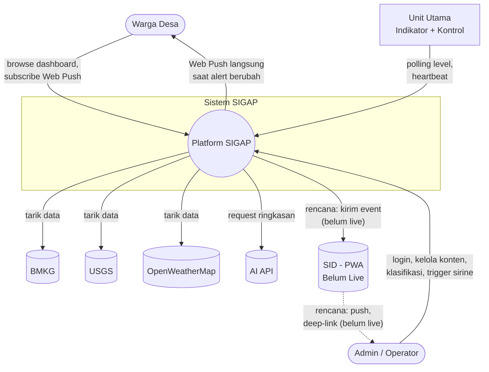

# 1. Introduction and Scope

## 1.1 Tujuan Sistem

SIGAP adalah platform monitoring lingkungan dan kesiapsiagaan bencana untuk Desa Cibenda, Kabupaten Pangandaran - mengolah data resmi (BMKG, USGS, OpenWeatherMap) menjadi informasi actionable, dilengkapi lapisan kesiapsiagaan fisik (indikator level dan sirine di titik strategis desa). Detail lengkap tujuan produk dan metrik keberhasilan ada di `PRD_SIGAP_v4.md`; dokumen ini fokus pada bentuk arsitekturnya.

## 1.2 Stakeholder

| Stakeholder | Kepentingan Terhadap Arsitektur |
|---|---|
| Warga Desa | Konsumen data publik (cuaca, alert, evakuasi) dan penerima Web Push notification langsung - tidak berinteraksi dengan kompleksitas arsitektur secara langsung |
| Admin/Operator | Pengguna Protected API - kelola konten, klasifikasi alert, kelola perangkat, trigger sirine |
| Tech Lead SIGAP | Pemilik keputusan arsitektur, penulis ADR |
| Tim IoT | Implementasi firmware perangkat, pihak yang menentukan kelayakan teknis keputusan hardware |
| Tech Lead SID | Pihak eksternal pada integrasi lintas sistem (Bagian 7) - **belum aktif**, lihat catatan status |
| QA/DevOps Coordinator | Konsumen dokumen ini untuk validasi dan deployment |

## 1.3 System Context Diagram

> **Catatan status:** jalur SID di bawah adalah desain yang **belum live** (lihat Bagian 7). Jalur Web Push langsung ke warga **sudah live** dan ditambahkan ke diagram - sebelumnya tidak tergambar sama sekali.

## 1.4 Batasan Arsitektur (Constraints)

Diwarisi dari governance program (Konteks Umum Program - Tech Lead), berlaku mengikat untuk SIGAP:

- **Independent domain** - SIGAP tidak berbagi database dengan SID maupun sistem lain dalam program (lihat ADR-022, Bagian 7 - integrasi ini sendiri belum aktif, prinsip independent domain tetap berlaku terlepas dari itu).
- **Tidak boleh deep microservices/tight coupling** - integrasi lintas sistem (SID) dibatasi pada API-based communication, bukan akses langsung ke internal masing-masing sistem.
- **Standardisasi lintas sistem** - identifier convention (UUID, ADR-001), auth pattern, dan naming convention mengikuti kesepakatan program, bukan preferensi SIGAP sendiri semata.
- **Delivery > Complexity** - tercermin di beberapa ADR (mis. ADR-013, ADR-027 - memilih mempertahankan implementasi yang sudah berjalan alih-alih migrasi ke solusi yang "lebih elegan" di atas kertas).