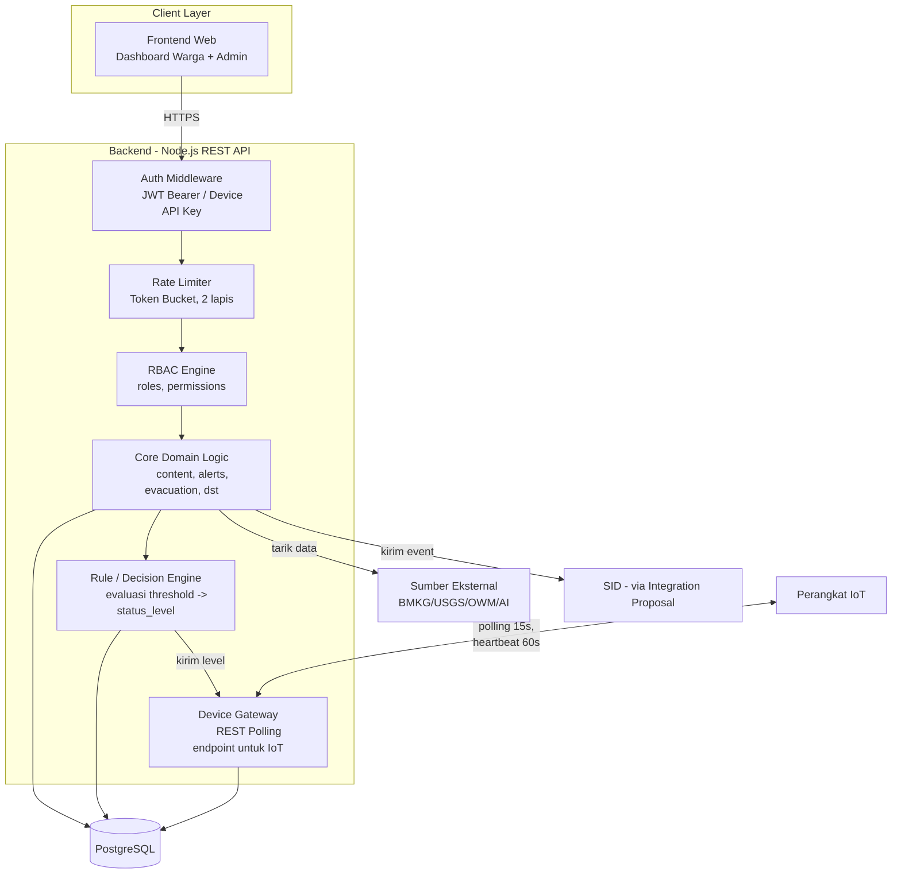

# 2. Building Block View

## 2.1 Component Diagram

## 2.2 Deskripsi Building Block

| Building Block | Tanggung Jawab | ADR Terkait |
|---|---|---|
| **Frontend Web** | Dashboard warga (Public) dan panel admin (Protected); mengonsumsi `api/openapi.yaml` | ADR-016, ADR-017 |
| **Auth Middleware** | Validasi JWT (user) atau API Key (device); menentukan kategori Public/Protected/Device Gateway | ADR-005, ADR-024 |
| **Rate Limiter** | Token Bucket, dua lapis (aplikasi + reverse proxy) | ADR-008, ADR-009, ADR-010 |
| **RBAC Engine** | Resolusi permission dari role pengguna sebelum mengizinkan aksi Protected | ADR-006, ADR-007 |
| **Rule/Decision Engine** | Evaluasi data lingkungan terhadap threshold, menghasilkan `status_level`, menulis ke `alert_log` | ADR-003 |
| **Device Gateway** | Endpoint M2M untuk perangkat IoT — polling level, heartbeat, laporan event sirine lokal | ADR-013 |
| **Core Domain Logic** | CRUD konten (pengumuman, evakuasi, kontak darurat), validasi alert, manajemen user | ADR-006, ADR-018 |
| **PostgreSQL** | Penyimpanan seluruh entity, menegakkan integrity constraint (mis. `chk_operator_id_matches_source`) | ADR-002, ADR-014 |

## 2.3 Prinsip Pemisahan

Device Gateway sengaja dipisahkan sebagai building block tersendiri, bukan bagian dari Core Domain Logic — karena jalur otentikasinya berbeda total (Device API Key, bukan JWT pengguna) dan siklus hidupnya independen (perangkat tidak "login" seperti pengguna manusia).
