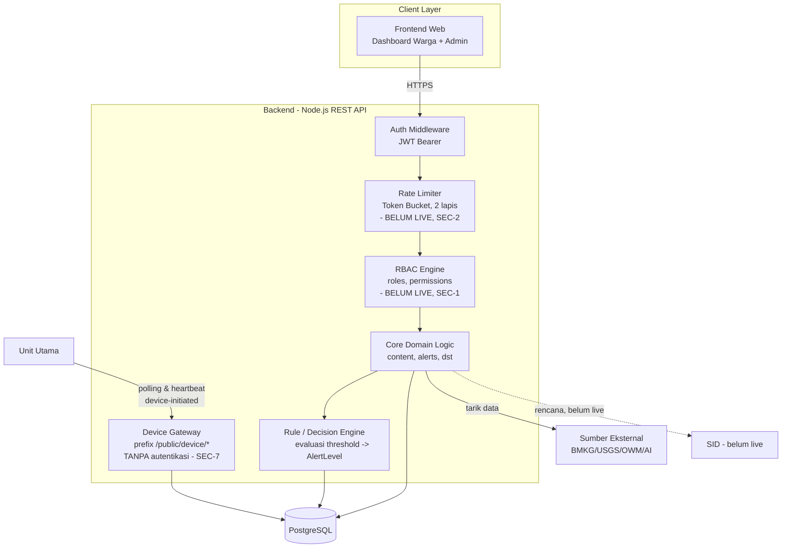

# 2. Building Block View

## 2.1 Component Diagram

> **Catatan status:** RBAC Engine dan Rate Limiter di bawah adalah **desain target**, belum live (Story SEC-1, SEC-2). Device Gateway sudah live untuk register/heartbeat/status, tanpa autentikasi (Story SEC-7).

## 2.2 Deskripsi Building Block

| Building Block | Tanggung Jawab | Status | ADR Terkait |
|---|---|---|---|
| **Frontend Web** | Dashboard warga (Public) dan panel admin (Protected) | Live | ADR-021, ADR-027 |
| **Auth Middleware** | Validasi JWT pengguna; menentukan kategori Public/Protected | Live (validasi token), permission belum ditegakkan | ADR-005 |
| **Rate Limiter** | Token Bucket, dua lapis | Belum ada sama sekali | ADR-008, ADR-009, ADR-010 (Story SEC-2) |
| **RBAC Engine** | Resolusi permission dari role sebelum mengizinkan aksi Protected | Skema ada, enforcement belum | ADR-006, ADR-007 (Story SEC-1) |
| **Rule/Decision Engine** | Evaluasi data lingkungan terhadap threshold, menghasilkan `AlertLevel`, menulis ke `alerts` | Live | ADR-003, ADR-030 |
| **Device Gateway** | Endpoint untuk Unit Utama - register, heartbeat, status agregat, di bawah prefix `/public/device/*` | Live tanpa autentikasi | ADR-013, ADR-028 (Story SEC-7) |
| **Core Domain Logic** | CRUD konten, klasifikasi alert, manajemen user | Sebagian - lihat status per domain di `03_data_architecture.md` S3.2 | ADR-006 |
| **PostgreSQL** | Penyimpanan entity yang sudah live, menegakkan integrity constraint | Live | ADR-002 |

## 2.3 Prinsip Pemisahan

Device Gateway sengaja dipisahkan sebagai building block tersendiri, bukan bagian dari Core Domain Logic — karena jalur otentikasinya berbeda (target: `X-Device-Secret` per `deviceCode`, belum diimplementasikan) dan siklus hidupnya independen (perangkat tidak "login" seperti pengguna manusia). **Koreksi dari versi sebelumnya:** pemisahan ini **bukan** namespace URL terpisah (`/device/*`) - Device Gateway tetap di bawah prefix `/public/*` yang sama, dibedakan lewat requirement autentikasi di level middleware (lihat ADR-028).