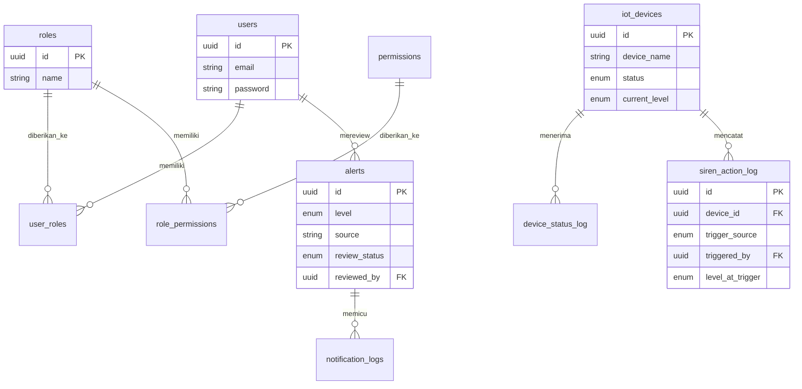

# 3. Data Architecture

> Rincian tipe data, constraint, dan contoh nilai per field ada di `db/data-dictionary/`. Bagian ini menyajikan ringkasan relasi antar-entity - bukan pengganti Data Dictionary.

## 3.1 Entity Relationship Diagram (Ringkas)

**Koreksi dari versi sebelumnya:** `announcements` dihapus dari ERD - CRUD lokal sudah deprecated (proxy read-only dari SID, lihat Roadmap Tahap 2). Entity `alert_log` diganti nama jadi `alerts` dengan field `severity`/`validated_by`/`validated_at` diganti `level`/`reviewed_by`/`review_status` - lihat penjelasan lengkap di `004_environmental.sql` revisi & `DD_environmental.md`.

## 3.2 Ringkasan Domain Entity

| Domain | Entity | File Skema | Status Implementasi |
|---|---|---|---|
| Users & Auth | `users` | `002_users.sql` | Live |
| RBAC | `roles`, `permissions`, `role_permissions`, `user_roles` | `006_rbac.sql` | Live |
| Konten Admin | `evacuation_points`, `evacuation_routes`, `emergency_contacts`, `preparedness_guides` | `003_content_admin.sql` | Sebagian - `emergency_contacts` & `preparedness_guides` sudah live di Prisma, `evacuation_points`/`evacuation_routes` belum |
| Lingkungan & Alert | `environmental_data`, `alerts` | `004_environmental.sql` | Sebagian - `alerts` live (skema berbeda dari dokumen lama, lihat revisi), `environmental_data` belum |
| IoT Kesiapsiagaan | `iot_devices` (skema penuh), `device_status_log`, `siren_action_log` | `005_iot_kesiapsiagaan.sql` | Sebagian - hanya `Device` versi sederhana (tanpa lat/lng/deviceType) yang live, dua lainnya belum ada sama sekali |
| Notifikasi *(baru, sebelumnya tidak terdaftar di sini)* | `push_subscriptions`, `notification_logs` | *(belum ada file skema/DD terpisah - gap)* | Live |

*(Kolom "Status Implementasi" ditambahkan - sebelumnya dokumen ini tidak membedakan mana yang sudah live vs murni desain, berisiko dianggap semuanya sudah terwujud.)*

## 3.3 Prinsip Arsitektur Data

- **Identifier**: UUID di seluruh tabel tanpa kecuali (ADR-001) - terverifikasi konsisten di Prisma nyata.
- **Status kesiapsiagaan**: satu ENUM dipakai lintas domain - **koreksi**: enum nyata adalah `AlertLevel` (`GREEN/YELLOW/ORANGE/RED`), bukan `status_level` berlabel Indonesia (`hijau/kuning/oranye/merah`) seperti versi dokumen sebelumnya. Label Indonesia adalah pemetaan tampilan di frontend, bukan nilai yang disimpan.
- **Integrity ditegakkan di database, bukan hanya di aplikasi** - `chk_operator_id_matches_source` pada `siren_action_log` (ADR-014) **masih murni desain**, belum terverifikasi ada di database nyata karena tabelnya sendiri belum dimigrasikan.
- **Audit standar**: `created_at`/`updated_at` pada tabel yang datanya dapat berubah - terverifikasi konsisten di seluruh model Prisma nyata.