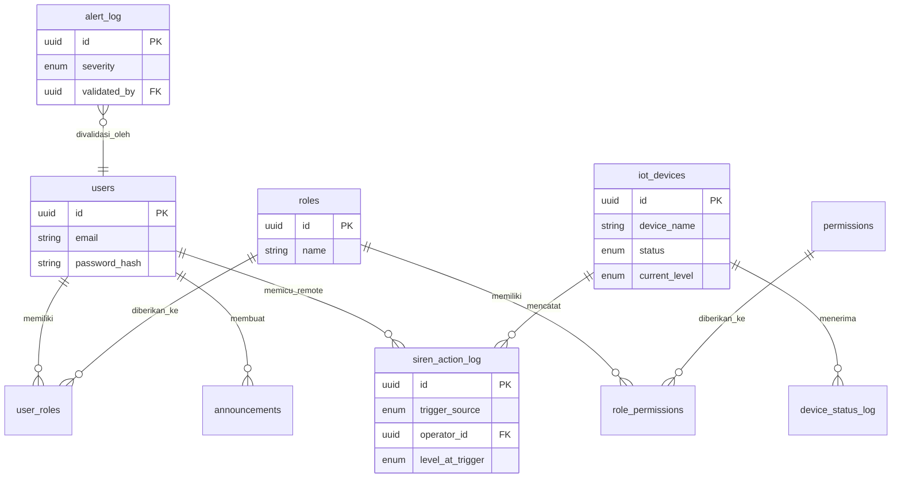

# 3. Data Architecture

> Rincian tipe data, constraint, dan contoh nilai per field ada di `db/data-dictionary/`. Bagian ini menyajikan ringkasan relasi antar-entity — bukan pengganti Data Dictionary.

## 3.1 Entity Relationship Diagram (Ringkas)

## 3.2 Ringkasan Domain Entity

| Domain | Entity | File Skema |
|---|---|---|
| Users & Auth | `users` | `002_users.sql` |
| RBAC | `roles`, `permissions`, `role_permissions`, `user_roles` | `006_rbac.sql` |
| Konten Admin | `announcements`, `evacuation_points`, `evacuation_routes`, `emergency_contacts` | `003_content_admin.sql` |
| Lingkungan & Alert | `environmental_data`, `alert_log` | `004_environmental.sql` |
| IoT Kesiapsiagaan | `iot_devices`, `device_status_log`, `siren_action_log` | `005_iot_kesiapsiagaan.sql` |

## 3.3 Prinsip Arsitektur Data

- **Identifier**: UUID di seluruh tabel tanpa kecuali (ADR-001).
- **Status kesiapsiagaan**: satu ENUM (`status_level`) dipakai lintas domain — tidak ada definisi ulang per tabel (ADR-003).
- **Integrity ditegakkan di database**, bukan hanya di aplikasi — contoh: `chk_operator_id_matches_source` pada `siren_action_log` (ADR-014).
- **Audit standar**: `created_at`/`updated_at` pada tabel yang datanya dapat berubah; kolom waktu spesifik kejadian (`triggered_at`, `recorded_at`) terpisah dari audit timestamp.
