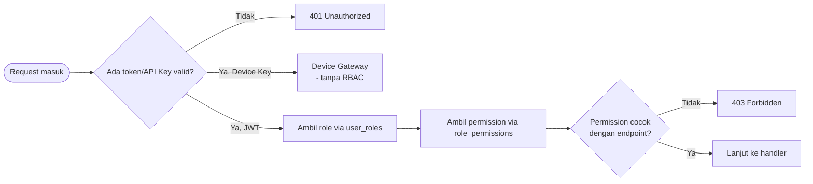

# 4. Security Architecture

## 4.1 Kategorisasi Akses

Tiga kategori akses berlaku di SIGAP:

| Kategori | Autentikasi | Contoh |
|---|---|---|
| Public | Tidak ada | `GET /api/public/alerts` |
| Protected | JWT Bearer (user) | `POST /api/protected/announcements` |
| Device Gateway | API Key (`X-Device-Key`) | `GET /device/{id}/level` |

Detail lengkap kategorisasi tiap endpoint: `api/ROUTE_ACCESS_DESIGN.md` (ADR-005).

## 4.2 Alur Otorisasi RBAC

Struktur tabel (`roles`, `permissions`, `role_permissions`, `user_roles`) dan seed default: ADR-006, ADR-007.

## 4.3 Rate Limiting

| Aspek | Keputusan |
|---|---|
| Algoritma | Token Bucket (ADR-008) |
| Layering | Aplikasi + reverse proxy (ADR-009) |
| Baseline | Login 5/15 menit, GET publik 100/menit, AI Summary 20/menit (ADR-010) |

## 4.4 Prinsip Keamanan Lintas Domain

- Identifier tidak dapat ditebak (UUID, ADR-001) — mengurangi permukaan serangan enumerasi resource pada endpoint Public.
- Autentikasi device (Device Gateway) terpisah total dari autentikasi pengguna — mencegah credential pengguna dipakai untuk memalsukan identitas perangkat, dan sebaliknya.
- Integrity constraint audit trail ditegakkan di database (ADR-014), bukan hanya validasi aplikasi — mengurangi risiko data audit yang tidak konsisten akibat bug atau jalur penulisan data yang tidak terduga.
