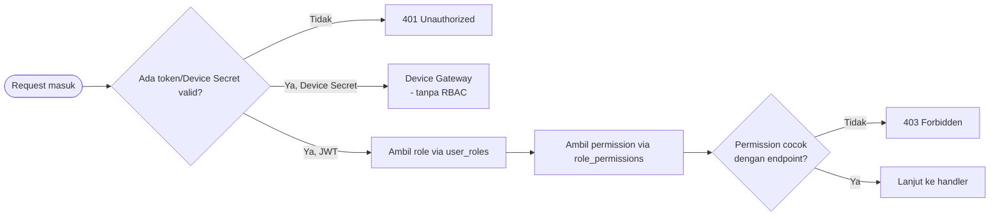

# 4. Security Architecture

## 4.0 Catatan Status (baru)

Dokumen ini menggambarkan **desain target** yang sudah disepakati (RBAC, rate limiting, kategorisasi akses). Audit kode terbaru mengonfirmasi sebagian besar **belum terimplementasi**: nol middleware permission (`403`) dan nol rate limiting ditemukan di backend. Status implementasi per bagian ditandai eksplisit di bawah, dengan rujukan ke Story Epic E0 (Security & Hardening, Sprint Plan Tahap 2 v2) yang menutup gap ini.

## 4.1 Kategorisasi Akses

Tiga kategori akses berlaku di SIGAP:

| Kategori | Autentikasi | Contoh | Status |
|---|---|---|---|
| Public | Tidak ada | `GET /api/public/alerts` | Live |
| Protected | JWT Bearer (user) | `POST /api/protected/users` | Token divalidasi (live), permission belum ditegakkan (belum ada `403`) |
| Device Gateway | `X-Device-Secret` per `deviceCode` *(direvisi - bukan `X-Device-Key`)* | `POST /api/public/device/heartbeat` | Belum ada autentikasi apa pun saat ini - target Story SEC-7 |

**Koreksi dari versi sebelumnya:** Device Gateway sebelumnya didokumentasikan dengan path `/device/{id}/level` dan header `X-Device-Key`. Audit kode menemukan realita berbeda: endpoint device (`register`/`heartbeat`/`status`) berada di bawah prefix `/api/public/device/*` yang sama seperti route Public biasa (bukan namespace terpisah), device diidentifikasi lewat `deviceCode` di body request (bukan `{id}` di path), dan **tidak ada middleware auth apa pun** terpasang saat ini. Autentikasi `X-Device-Secret` adalah proposal Tech Lead, belum diimplementasikan - lihat Story SEC-7.

Detail lengkap kategorisasi tiap endpoint: `security_and_access_control/ROUTE_ACCESS_DESIGN.md`.

## 4.2 Alur Otorisasi RBAC - Desain Target

**Status:** struktur data (`roles`, `permissions`, `role_permissions`, `user_roles`) **sudah ada dan cocok** dengan diagram ini - bagian yang belum ada adalah langkah `ResolveRole → ResolvePerm → CheckPerm` itu sendiri, belum ada satu middleware pun yang menjalankannya (`req.user` saat ini hanya diverifikasi valid-tidaknya token, tidak dicek permission-nya). Implementasi: Story **SEC-1** (RBAC Enforcement Middleware).

Struktur tabel dan seed default: ADR-006, ADR-007, `DD_rbac.md`.

## 4.3 Rate Limiting - Belum Terimplementasi

| Aspek | Keputusan (Desain) | Status |
|---|---|---|
| Algoritma | Token Bucket (ADR-008) | Belum ada kode |
| Layering | Aplikasi + reverse proxy (ADR-009) | Belum ada kode |
| Baseline | Login 5/15 menit **per-IP dan per-akun** *(direvisi - sebelumnya cuma per-IP)*, GET publik 100/menit, AI Summary 20/menit (ADR-010) | Belum ada kode |

**Koreksi dari versi sebelumnya:** baseline login sebelumnya hanya menyebut pembatasan per-IP. FS-01/Story SEC-2 menambahkan lockout **per-akun** juga - mencegah penyerang memutar banyak IP untuk membobol satu akun target, skenario yang tidak tertutup oleh pembatasan per-IP saja. Implementasi: Story **SEC-2**.

## 4.4 Prinsip Keamanan Lintas Domain

- Identifier tidak dapat ditebak (UUID, ADR-001) - mengurangi permukaan serangan enumerasi resource pada endpoint Public. *(Sudah sesuai kode nyata - seluruh primary key di schema memakai `@default(uuid())`.)*
- Autentikasi device (Device Gateway) **direncanakan** terpisah total dari autentikasi pengguna, mencegah credential pengguna dipakai memalsukan identitas perangkat dan sebaliknya. *(Koreksi status - saat ini belum "terpisah total", karena device endpoint belum punya autentikasi sama sekali. Pernyataan ini benar sebagai prinsip desain, salah sebagai deskripsi kondisi berjalan. Target: Story SEC-7.)*
- Integrity constraint audit trail ditegakkan di database (ADR-014), bukan hanya validasi aplikasi - mengurangi risiko data audit yang tidak konsisten akibat bug atau jalur penulisan data yang tidak terduga. *(Belum saya verifikasi terhadap ADR-014 - dokumen itu belum saya lihat isinya. Tidak saya klaim benar/salah, cuma flag.)*
- **Baru** - Envelope error terstandardisasi (`success`/`message`/`errors: array`) di seluruh response, termasuk error 401/403/404/409/429 - audit menemukan bentuk `errors` saat ini **campur-campur** (array, array kosong, object validasi, object kosong) di kode nyata. Target: Story **SEC-9**.