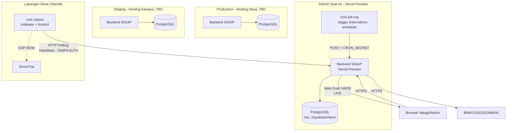

# 8. Deployment View

## 8.1 Topologi

Sesuai arah deployment program (Context Program): **Production** di-hosting di server desa, **Staging** di-hosting di kampus. **Kondisi interim saat ini** (belum sesuai target): deployment dev/preview berjalan di Vercel Preview (branch `dev`), dipicu cron eksternal (cron-job.org) untuk scheduler alert.

## 8.2 Status Hosting

| Environment | Status | Catatan |
|---|---|---|
| Production | TBD, menunggu konfirmasi Tim DevOps | Arah program: hosting desa (lihat PRD §4) |
| Staging | TBD, menunggu konfirmasi Tim DevOps | Arah program: hosting kampus |
| Interim (dev) | **Aktif** | Vercel Preview branch `dev`, scheduler dipicu cron-job.org eksternal setiap 1 menit |

## 8.3 Urutan Migrasi Database

> **Gap penting, perlu diklarifikasi:** urutan file bernomor di bawah adalah **rencana migrasi manual**, ditulis sebelum implementasi. Database live nyata dikonfirmasi dikelola lewat **Prisma** (`schema.prisma`), yang sudah memuat tabel tidak tercakup dalam 6 file ini (`PushSubscription`, `NotificationLog`, `EarthquakeRecord`) dan struktur berbeda untuk tabel yang tumpang tindih (mis. `Alert`, lihat `004_environmental.sql` revisi). **Belum jelas** apakah 6 file SQL ini masih dipakai sebagai referensi desain saja, atau pernah/akan dijalankan langsung terpisah dari `prisma migrate` - perlu dipastikan ke tim backend, karena kalau keduanya berjalan independen, risiko schema drift nyata (persis kasus casing RBAC yang sudah terjadi).
- 001_core_types.sql (extension, ENUM, trigger function)
- 002_users.sql (tidak bergantung tabel lain) - LIVE, lihat revisi
- 003_content_admin.sql (bergantung: users) - SEBAGIAN LIVE, lihat revisi
- 004_environmental.sql (bergantung: 001) - SEBAGIAN LIVE, struktur direvisi total
- 005_iot_kesiapsiagaan.sql (bergantung: 001, 002) - BELUM LIVE sama sekali
- 006_rbac.sql (bergantung: 002) - LIVE, casing kolom sudah diverifikasi & diperbaiki

## 8.4 Environment Variables

> Diperbarui berdasarkan audit langsung terhadap kode dan file `.env*` yang ditemukan - bukan lagi murni kerangka rencana.

| Variable | Deskripsi | Status |
|---|---|---|
| `DATABASE_URL`, `DIRECT_URL` | Connection string PostgreSQL | Live |
| `JWT_SECRET` | Kunci penandatanganan token pengguna | Live |
| `JWT_EXPIRES_IN` | Masa berlaku token, default `"1d"` | Live |
| `CRON_SECRET` | Proteksi endpoint `/internal/run-scheduler` - **saat ini opsional** (endpoint terbuka kalau tidak di-set), target: wajib (Story SEC-8) | Live, perlu hardening |
| `VAPID_PUBLIC_KEY`, `VAPID_PRIVATE_KEY`, `VAPID_SUBJECT` | Kredensial Web Push | Live |
| `BMKG_ADM4_CODE` | Kode wilayah BMKG untuk cuaca (default `32.18.01.2008`) | Live |
| `VILLAGE_LAT`, `VILLAGE_LON` | Koordinat desa untuk hitung `distanceToVillage` | Live |
| `X-Device-Secret` (nama env var final belum ditentukan) | Autentikasi Device Gateway | Belum ada (Story SEC-7) |
| `SID_API_KEY` | Kunci autentikasi ke SID (interim, ADR-024) | Belum relevan - integrasi SID belum dibangun |
| `USGS_API_*`, `OWM_API_KEY` | Kredensial sumber data eksternal lain | Belum terverifikasi ada di `.env` manapun yang ditemukan audit |
| `AI_API_KEY` | Kredensial layanan AI Summary | Belum terverifikasi - fitur AI Summary sendiri belum live |

**Catatan:** `.env.example` **tidak ditemukan** di repo (temuan audit) - Story SEC-11 menutup gap ini.