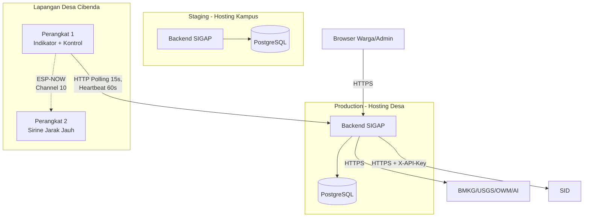

# 8. Deployment View

## 8.1 Topologi

Sesuai arah deployment program (Context Program): **Production** di-hosting di server desa, **Staging** di-hosting di kampus.



## 8.2 Status Hosting

| Environment | Status | Catatan |
|---|---|---|
| Production | TBD, menunggu konfirmasi Tim DevOps | Arah program: hosting desa (lihat PRD §4) |
| Staging | TBD, menunggu konfirmasi Tim DevOps | Arah program: hosting kampus |

## 8.3 Urutan Migrasi Database

Skema dijalankan sesuai urutan penomoran file di `db/schema/`, mencerminkan dependency foreign key:

```
001_core_types.sql       (extension, ENUM, trigger function)
002_users.sql            (tidak bergantung tabel lain)
003_content_admin.sql    (bergantung: users)
004_environmental.sql    (bergantung: 001 - status_level)
005_iot_kesiapsiagaan.sql (bergantung: 001, 002)
006_rbac.sql             (bergantung: 002 - users)
```

## 8.4 Environment Variables (Kerangka Awal)

> Daftar ini kerangka awal untuk memulai — bukan daftar final, akan bertambah seiring implementasi.

| Variable | Deskripsi |
|---|---|
| `DATABASE_URL` | Connection string PostgreSQL |
| `JWT_SECRET` | Kunci penandatanganan token pengguna |
| `DEVICE_API_KEY_*` | Kunci autentikasi per perangkat IoT (skema provisioning belum final) |
| `SID_API_KEY` | Kunci autentikasi ke SID (interim, ADR-024) |
| `BMKG_API_*`, `USGS_API_*`, `OWM_API_KEY` | Kredensial sumber data eksternal |
| `AI_API_KEY` | Kredensial layanan AI Summary |
