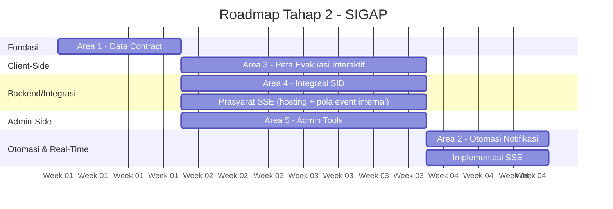

# SIGAP - Rencana Pengembangan Tahap 2

| | |
|---|---|
| **Document Type** | Development Roadmap |
| **Status** | Draft - Aktif |
| **Version** | 1.0 |
| **Date** | 27 Juli 2026 |
| **Author** | Tech Lead, SIGAP |
| **Dokumen Terkait** | PRD SIGAP v4.0, ADR-001 s.d. ADR-025, `architecture/`, `api/openapi.yaml` |

---

## 1. Latar Belakang

Tahap 2 dipicu oleh peninjauan implementasi client-side yang sudah berjalan (Tahap 1) terhadap kontrak arsitektur yang sudah disepakati (ADR, schema, API spec). Peninjauan ini menemukan sejumlah penyesuaian yang perlu dilakukan pada data contract, satu reversal arsitektur (sumber data Announcements), dan kebutuhan baru (PreparednessGuide, refresh strategy). Dokumen ini merangkum seluruh temuan menjadi satu rencana kerja terstruktur.

---

## 2. Ringkasan Perubahan dari Tahap 1

### 2.1 Berubah

| # | Item | Dari → Jadi |
|---|---|---|
| 1 | `WeatherForecastItem` | Field `date` → `local_datetime` (timestamp lengkap dengan jam, bukan cuma tanggal) |
| 2 | Endpoint gempa | `GET /public/earthquakes/latest` → `GET /public/earthquakes?scope=pangandaran\|jawa_barat\|indonesia`; `data` boleh `null` bila tidak ada gempa yang lolos filter radius/umur |
| 3 | Sumber data `GET /public/announcements` | Tabel SIGAP sendiri → proxy dari API SID (backend-to-backend, difilter: header/deskripsi/waktu, hanya yang berstatus public di SID) |
| 4 | Tabel `announcements` + endpoint Protected CRUD SIGAP | Aktif → **deprecated** (dipertahankan di schema, tidak dihapus fisik, tidak dipakai aktif) |
| 5 | Kanal notifikasi (ADR-022) | SID sebagai satu-satunya kanal → **dual-channel**: SID + Web Push milik SIGAP sendiri (redundansi, prinsip fail-safe yang sama dengan ADR-004/025) |
| 6 | Threshold Rule Engine | Diklarifikasi: **bukan** threshold yang dihitung SIGAP dari data mentah - level (Waspada/Siaga/Awas, dst) diambil langsung dari klasifikasi resmi BMKG per sumber, SIGAP hanya melakukan mapping ke `status_level`. Fitur konfigurasi threshold di admin panel **tidak diperlukan**. |

### 2.2 Baru

| # | Item | Keterangan |
|---|---|---|
| 1 | Entity `preparedness_guides` | Hybrid: field `content` (nullable) dan `external_url` (nullable), constraint minimal satu terisi; `source_type` (resmi/mitra); `published_at` |
| 2 | Endpoint PreparednessGuide | Public GET (list/detail) + Protected CRUD admin |
| 3 | ADR baru - Integrasi SID→SIGAP (Announcements) | Arah kedua integrasi lintas sistem, kebalikan ADR-022 (yang arahnya SIGAP→SID) |
| 4 | ADR baru - Dual-channel notification | SIGAP Web Push + SID berjalan bersamaan, bukan saling menggantikan |
| 5 | NFR - Interval refresh frontend | Dipisahkan eksplisit dari interval polling IoT (15 detik, ADR-013) - lihat Bagian 4 |
| 6 | Tabel mapping klasifikasi BMKG → `status_level` | Per sumber data (cuaca, gempa, tsunami masing-masing punya taksonomi sendiri) - dicatat sebagai pekerjaan rumah Area 1/2, belum dikerjakan pada dokumen ini |

---

## 3. Area Pengembangan Tahap 2

| Area | Cakupan | Bergantung Pada |
|---|---|---|
| **Area 1 - Data Contract** | Seluruh item Bagian 2.1 & 2.2 yang menyentuh schema/API | - (fondasi, dikerjakan lebih dulu) |
| **Area 2 - Otomasi Status & Notifikasi** | Rule Engine mem-publish event internal setelah menulis `alert_log`/`iot_devices.current_level`, dikonsumsi oleh kanal notifikasi (dual-channel) | Area 1, Area 4 |
| **Area 3 - Peta Evakuasi Interaktif** | Migrasi dari hardcode ke Leaflet + API `evacuation_points`/`evacuation_routes`, fitur arahkan-ke-titik-terdekat via GPS | Area 1 |
| **Area 4 - Integrasi Notifikasi dengan SID** | Finalisasi kontrak API, autentikasi resmi (menggantikan API Key interim ADR-024), implementasi kedua arah (SIGAP→SID notifikasi, SID→SIGAP announcements) | Area 1 |
| **Area 5 - Admin-Side** | Lihat Bagian 5 untuk daftar fitur lengkap | Area 1 (fondasi), sebagian bergantung Area 3 (data model evakuasi) |

Area 3, Area 4, dan Area 5 berjalan **paralel** setelah Area 1 selesai. Area 2 menyusul setelah Area 4 selesai (butuh kanal notifikasi siap sebelum otomasi dibangun di atasnya).

---

## 4. Strategi Refresh Data - Menuju Server-Sent Events (SSE)

### 4.1 Konteks

Kecepatan tampilan data di dashboard dibentuk oleh tiga mata rantai berbeda, masing-masing punya batas kecepatan sendiri:

```
BMKG/USGS/OWM  →  Backend SIGAP  →  Frontend Dashboard
                        │
                        └──────────→  Perangkat IoT (final: polling 15 detik, ADR-013)
```

### 4.2 Keputusan

SSE dipilih menggantikan polling tetap (8 detik) - pertimbangan: kebutuhan komunikasinya satu arah (backend → dashboard), butuh cepat saat kondisi kritis namun hemat saat kondisi normal. WebSocket dipertimbangkan namun tidak dipilih karena menyelesaikan masalah yang sama dengan overhead dua-arah yang tidak diperlukan.

### 4.3 Risiko

| Risiko | Penjelasan |
|---|---|
| Konfigurasi reverse proxy | Perlu `proxy_buffering off` dan timeout disesuaikan - default proxy membuffer response, menghilangkan sifat real-time SSE |
| Koneksi idle diputus infra | Perlu heartbeat berkala agar tidak dianggap mati oleh jaringan/proxy |
| Auth terbatas di `EventSource` native | Tidak mendukung custom header - tidak masalah untuk dashboard Public, jadi batasan bila admin-side kelak juga butuh SSE dengan JWT |
| Event hilang saat reconnect | Perlu mekanisme resync eksplisit, tidak otomatis "mengejar ketinggalan" |
| Beban koneksi bersamaan | Perlu batas NFR eksplisit, jangan ditemukan tanpa sengaja saat live |
| Fallback saat SSE gagal | Sebagian jaringan/proxy memblokir koneksi long-lived - perlu jalur mundur ke polling |

### 4.4 Prasyarat (Urutan Blocking)

1. **Hosting mendukung koneksi long-lived** - terkait langsung isu terbuka di `architecture/10_risks_and_open_issues.md` (hosting production/staging masih TBD)
2. **Pola event internal di backend** - Rule Engine mem-publish event (mis. via `EventEmitter`) setelah menulis ke database; titik yang sama dipakai ulang oleh Area 2 (notifikasi)
3. Heartbeat berkala
4. Strategi resync (fetch ulang `/public/dashboard` saat reconnect)
5. Fallback otomatis ke polling saat `EventSource` gagal established
6. Batas jumlah koneksi bersamaan

Poin 1–2 bersifat blocking terhadap seluruh implementasi SSE. Poin 3–6 dapat dirancang paralel.

---

## 5. Fitur Admin-Side

### A. Operasional Harian
1. Login & Sesi (JWT, role admin/operator)
2. Verifikasi & Validasi Alert
3. ~~Kelola Pengumuman~~ - **dihapus dari cakupan**, sumber data pindah ke SID (lihat Bagian 2.1 #3-4)
4. Kelola Kontak Darurat
5. Kelola Titik & Jalur Evakuasi (menyusul Area 3)
6. Kelola Panduan Kesiapsiagaan (baru - dua mode input: artikel langsung atau link eksternal)

### B. Manajemen Perangkat & Keselamatan
7. Manajemen Perangkat IoT
8. Riwayat Status Device (`device_status_log`)
9. Riwayat Aktivasi Sirine (`siren_action_log`)
10. Trigger Sirine Remote - kontrak API sudah ada, fungsional menyusul setelah jalur remote diimplementasikan (ADR-012)

### C. Manajemen Pengguna & Monitoring Sistem
11. Manajemen Akun & Role
12. Dashboard Admin (ringkasan statistik)
13. Monitoring Integrasi SID (baru) - log status pengiriman notifikasi (berhasil/gagal/retry), agar kegagalan kanal notifikasi terlihat oleh admin, bukan hanya "diam-diam tetap berjalan" di backend

---

## 6. Timeline

1. **Area 1 - Data Contract** (fondasi)
2. **Paralel setelah Area 1:**
   - Area 3 - Peta Evakuasi Interaktif
   - Area 4 - Integrasi SID (kontrak final, autentikasi resmi)
   - Area 5 - Admin Tools
   - Prasyarat SSE #1 & #2 (hosting, pola event internal) - mulai paralel, tidak menunggu area lain
3. **Setelah Area 4 selesai:**
   - Area 2 - Otomasi Notifikasi
4. **Setelah prasyarat SSE lengkap:**
   - Implementasi SSE menggantikan polling - memakai titik publish event yang sama dari Area 2


---

## 7. Isu Terbuka yang Perlu Dipantau

| Isu | Terkait | Status |
|---|---|---|
| Hosting production/staging | Prasyarat SSE #1 | TBD (lihat `architecture/10_risks_and_open_issues.md`) |
| Tabel mapping klasifikasi BMKG → `status_level` per sumber | Area 1/2 | Belum dikerjakan |
| Kontrak API SID (kedua arah: notifikasi & announcements) | Area 4 | Menunggu sign-off Tim SID |
| Nasib fisik tabel `announcements` SIGAP yang deprecated | Area 1 | Dipertahankan dulu, keputusan hapus permanen ditunda |
